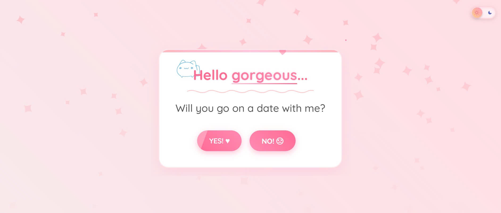

# Will You Date Me?

A cheeky, single-page date-invitation flow packed with drifting blossoms, jittery buttons, and way too many hearts. Built for browsers, not bravery; bravery is on you.

    

## What this does

- Starts with the classic question and a skittish "No" button that sprints like it saw a commit without tests.
- Walks the yes-path through cards: success screen, pick-a-place, pick-a-time (Flatpickr), pick-food, pick-drinks, leave-a-note, and a final summary.
- Lets you add custom options with word counters and gentle validations instead of modal rage.
- Plays background music with play/pause and volume controls; heart particles float everywhere because restraint was not a design goal.
- Sends a tidy invitation email via EmailJS with the chosen times, locations, food, drinks, and note.
- Light/dark toggle plus cherry blossom and cursor heart effects for maximum romantic energy.

## Quickstart

1. Clone or download this repo.
2. Serve the folder (module scripts prefer a server). Example: `python -m http.server 4173` from the project root, then visit `http://localhost:4173`.
3. Open the page. Click "Yes". Watch the "No" button panic. Proceed through the cards.

## EmailJS setup

1. Create an EmailJS account and a service/template.
2. In `index.html`, replace `PUBLIC_KEY` with your EmailJS public key.
3. Update the service and template IDs in `src/js/email.js` (currently `will-you-date-me`).
4. Deploy or serve again; the completion card form will send the invitation email with the collected data.

## Project structure

- `index.html` – all cards, music widget, and script/style wiring
- `src/js/` – logic split into modules (`main.js`, `flows.js`, `effects.js`, `dom.js`, `state.js`, `theme.js`, `email.js`)
- `src/css/` – styles, animations, themes, responsiveness
- `assets/` – images for places/food/drinks, background music track
- `backup/` – older CSS/JS snapshots

## Notable behaviors

- The "No" button repositions on hover with escalating snarky text.
- Custom inputs for location/food/drinks support up to 10 words with live counters; the note field allows 150 words.
- Date/time rows can be duplicated; validation highlights missing fields before letting you continue.
- Buttons spawn heart bursts; sections sprinkle hearts and cherry blossoms over time.
- Dark mode toggle flips body classes; background music defaults to 50% volume with adjustable steps.

## Development tips

- Keep assets relative to `index.html`; the page is fully static and fine on any static host.
- If you swap the music file, keep the MP3 path at `assets/music/` or update the `<audio>` source.
- Flatpickr is loaded from CDN; if you need offline use, bundle it locally.
- Want fewer hearts? Tweak counts in `src/js/effects.js` and `src/js/flows.js`.

## Roadmap ideas

- Persist selections across refreshes (localStorage).
- Add a printable summary card.
- Offer multiple music tracks with a tiny playlist.

## License

GPL-3.0. Ship it, remix it, and surprise someone.
